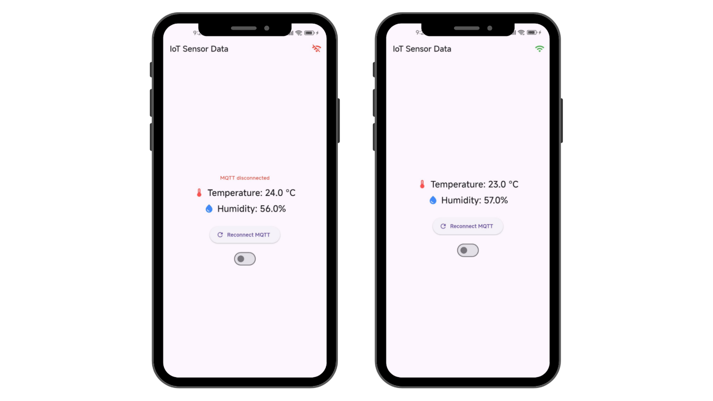
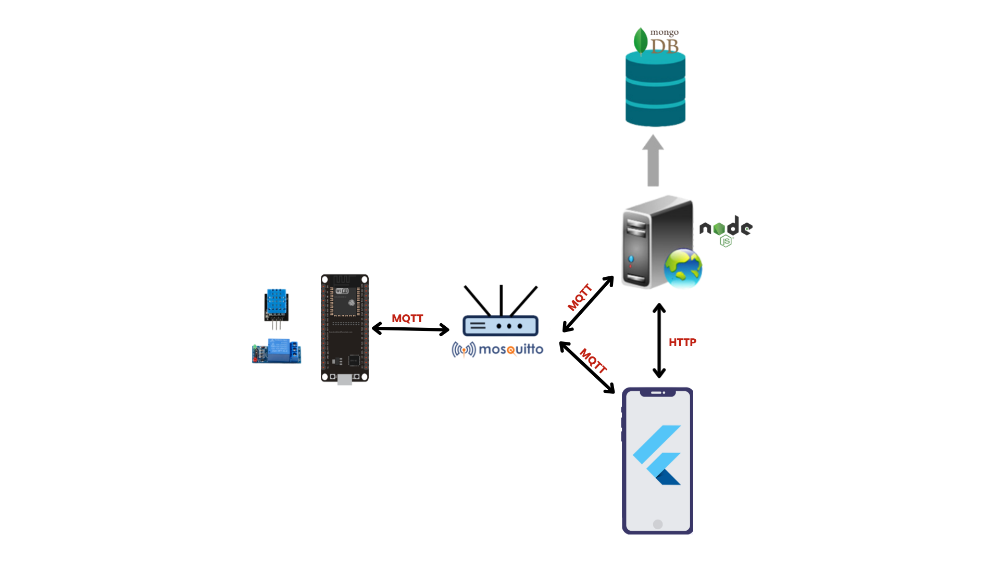

# Projet MQTT - Capteur DHT11, Backend Node.js et App Flutter

**Aperçu**
Ce projet lit la température et l'humidité avec un ESP32 + DHT11, publie les mesures via MQTT, stocke automatiquement l'historique dans MongoDB quand la température dépasse 30°C, puis affiche les données en temps réel et l'historique depuis une application Flutter.

L'application Flutter peut aussi envoyer une commande MQTT à l'ESP32 pour ouvrir ou fermer un relais.





**Fonctionnalités**
- Mesure périodique température/humidité (DHT11).
- Publication MQTT sur `iot/esp32/sensor_data`.
- Réception de commandes MQTT sur `iot/esp32/actuator_data` pour piloter le relais.
- Backend Node.js abonné au topic MQTT et stockage conditionnel dans MongoDB.
- API HTTP `GET /historique` pour récupérer l'historique.
- App Flutter qui affiche le temps réel (MQTT), récupère l'historique (HTTP) et envoie l'état du relais via MQTT.

**Matériel requis**
- ESP32.
- Capteur DHT11.
- Connexion Wi-Fi.

**Pré-requis logiciels**
- MicroPython sur ESP32.
- Broker MQTT (ex: Mosquitto) accessible sur le réseau local.
- Node.js + npm.
- MongoDB local.
- Flutter SDK.

**Structure**
- `main.py` : code MicroPython de l'ESP32 (capteur + relais + MQTT).
- `iot_backend/` : serveur Express + MQTT + MongoDB.
- `iot_frontend/` : application Flutter.
- `docs/architecture.svg` : schéma d'architecture.

**Configuration**
- Wi-Fi ESP32 : `main.py` (variables `ssid`, `password`).
- Broker MQTT : `main.py` (`mqtt_broker`), `iot_backend/app.js` (`mqtt.connect(...)`), `iot_frontend/lib/main.dart` (hôte MQTT).
- API backend : `iot_frontend/lib/main.dart` (URL `http://<ip>:3000/historique`).
- MongoDB : `iot_backend/app.js` (`mongodb://localhost:27017/iot`).

**Démarrage rapide**
1. Démarrer le broker MQTT.
2. Démarrer MongoDB en local.
3. ESP32 (MicroPython).

```bash
# Uploader main.py sur l'ESP32 puis redémarrer la carte
```

4. Backend.

```bash
cd iot_backend
npm install
npm start
```

5. Frontend Flutter.

```bash
cd iot_frontend
flutter pub get
flutter run
```

**API**
- `GET /historique` → retourne la liste des mesures enregistrées (JSON).

**Topics MQTT**
- `iot/esp32/sensor_data` : topic utilisé par l'ESP32 pour publier les mesures du capteur.

```json
{ "temperature": 25, "humidity": 60 }
```

- `iot/esp32/actuator_data` : topic utilisé par l'application Flutter pour envoyer une commande au relais de l'ESP32.

```json
{ "relay": 1 }
```

`"relay": 1` active le relais.  
`"relay": 0` désactive le relais.

**Notes**
- La logique de stockage est basée sur la condition `temperature > 30` dans `iot_backend/app.js`.
- Adaptez les IPs et SSID à votre réseau.
