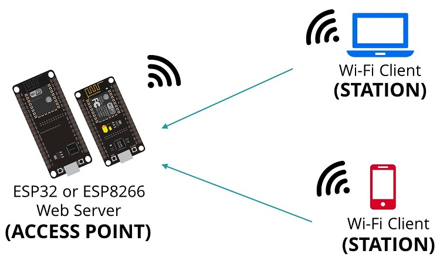
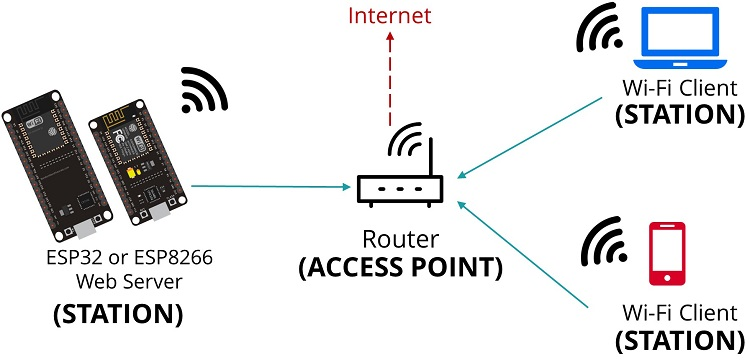

# Mode Access Point / Station (ESP32)

**Aperçu**
Ce mini‑projet montre la différence entre :
- Un ESP32 qui crée son propre réseau Wi‑Fi (AP).
- Un ESP32 qui se connecte à un réseau existant (STA).

**Images**

**Fichiers**
- `Mode_access.py` : active le mode **Access Point** et crée un réseau Wi‑Fi.
- `Mode_Station.py` : active le mode **Station** et se connecte à un routeur.

**Configuration**
- `Mode_access.py` → `ap.config(essid=..., password=...)`.
- `Mode_Station.py` → `WIFI_SSID`, `WIFI_PASSWORD`.

**Utilisation**
1. Flasher MicroPython sur l''ESP32.
2. Uploader le script souhaité.
3. Ouvrir le terminal série pour lire l''IP et les infos réseau.

**Notes**
- Adaptez le SSID et le mot de passe à votre environnement.
- GPIO non utilisé dans cet exemple.
