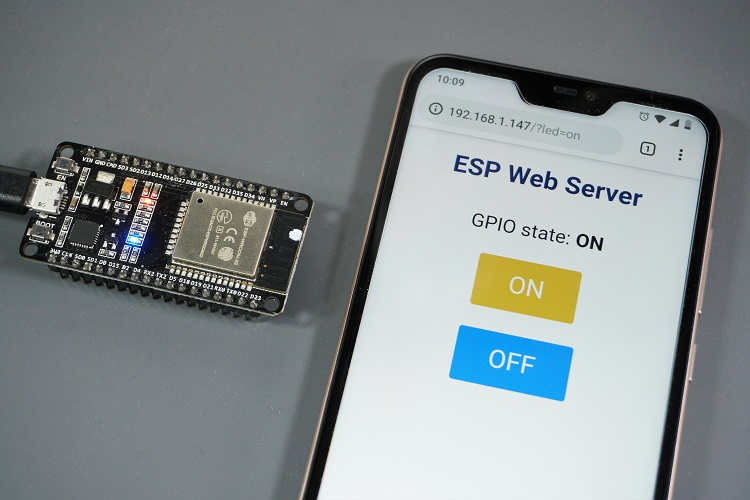

# Web Server ESP32 (Contrôle LED)

**Aperçu**
Ce mini‑projet met en place un serveur web HTTP sur l''ESP32 pour allumer/éteindre une LED via un navigateur.

**Image**

**Fichiers**
- `boot.py` : connexion au Wi‑Fi.
- `main.py` : serveur HTTP + page HTML de contrôle.

**Utilisation**
1. Flasher MicroPython sur l''ESP32.
2. Uploader `boot.py` et `main.py`.
3. Ouvrir le terminal série pour récupérer l''IP de l''ESP32.
4. Ouvrir `http://<ip_esp32>/` et cliquer sur ON/OFF.

**Configuration**
- Adapter le SSID/mot de passe dans `boot.py`.
- LED pilotée sur la broche GPIO 2.

**Notes**
- Le serveur écoute sur le port 80.
- Le HTML est généré dans `web_page()`.
