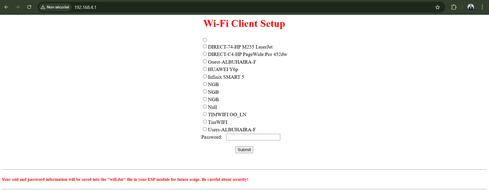
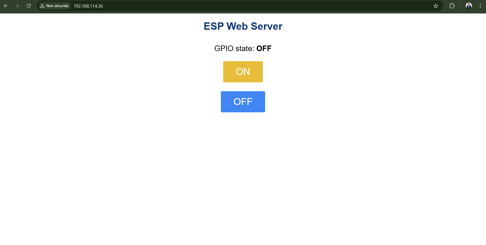

# WiFi Manager (Portail de Configuration)

**Aperçu**
Si l''ESP32 ne trouve pas de réseau, il crée un point d''accès `WifiManager` et ouvre un portail web pour saisir le SSID et le mot de passe. Les profils sont ensuite stockés pour les prochaines connexions.

**Images**

**Fichiers**
- `wifimgr.py` : logique du portail captif et stockage des profils.
- `main.py` : démarre le portail et lance un web server de contrôle LED.

**Configuration**
- `wifimgr.py` → `ap_ssid`, `ap_password`.
- Les réseaux enregistrés sont sauvegardés dans `wifi.dat`.

**Utilisation**
1. Flasher MicroPython sur l''ESP32.
2. Uploader `wifimgr.py` et `main.py`.
3. Se connecter au réseau `WifiManager`.
4. Ouvrir `http://192.168.4.1` et saisir vos identifiants.

**Notes**
- LED pilotée sur GPIO 2.
- Le portail se désactive automatiquement une fois connecté.
